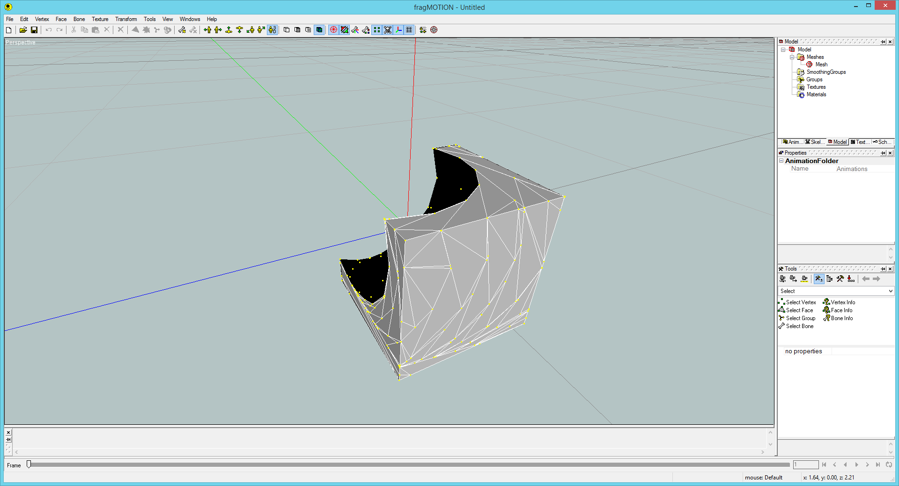
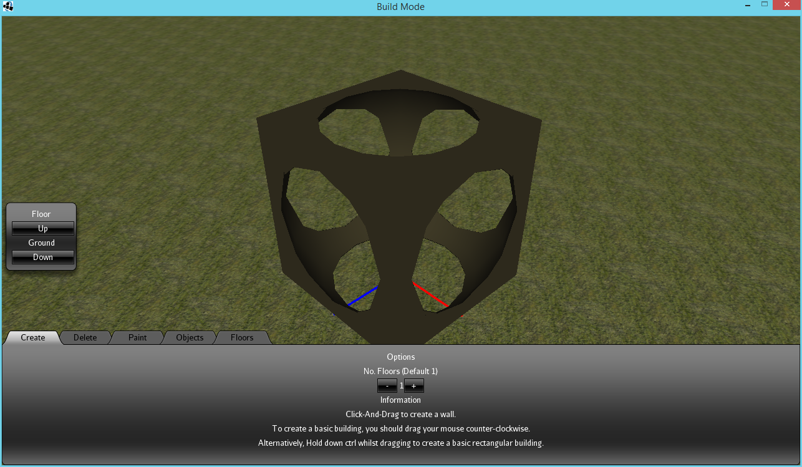
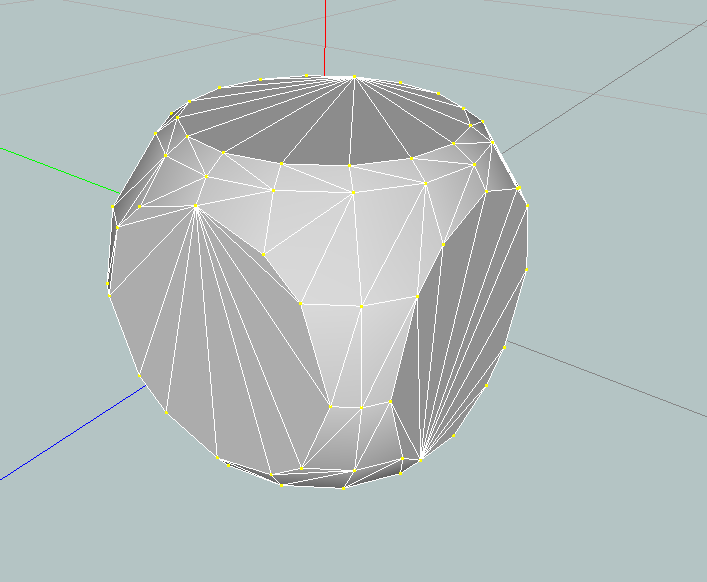

# Fabian CSG

Fabian CSG ([Constructive Shape Geometry](http://en.wikipedia.org/wiki/Constructive_solid_geometry)) is a library for [jMonkeyEngine](http://jmonkeyengine.org) that allows creating dynamic models with [boolean operations](http://en.wikipedia.org/wiki/Boolean_operations_on_polygons). 


  
  


## Features

- [x] Fully ported csg.js library (MIT license) to Java, using JMonkeyEngine’s Vector3f.
- [x] Added function to produce a Mesh from the CSG object.
- [x] Made CSG.shapeName( static functions into classes that extend CSG.
- [x] Created CSGNode class, which is used to sequentially add CSG brushes and output 1 geometry (Soon to be node)
- [x] Created a MeshBrush, which reads the TexCoord, Normal, Position and Index buffers of a Mesh to product a shape which can be used for CSG.
- [ ] Add Material support on a per-brush level.
- [ ] Add UV calculations to standard shapes (Cube, Sphere, Cylinder)
- [ ] LOD support? (Or polygon reduction)

## Usage

```java
Material mat_csg = assetManager.loadMaterial(“Materials/WallCover/BrownBricks.j3m”);
            mat_csg.getAdditionalRenderState().setFaceCullMode(FaceCullMode.Off);
            CSGNode csg = new CSGNode();
            csg.setMaterial(mat_csg);
            CubeBrush base = new CubeBrush(new Vector3f(0f, 0f, 0f), new Vector3f(1f, 1f, 1f));
            csg.addBrush(base);
            SphereBrush hole = new SphereBrush(new Vector3f(0f, 0f, 0f), 1.3f, 16, 8);
            hole.setType(BrushType.SUBTRACTIVE);
            csg.addBrush(hole);
            csg.regenerate();
            csg.move(0f, 1f, 0f);
            this.app.getRootNode().attachChild(csg);
```


```java
Material mat_csg = assetManager.loadMaterial(“Materials/WallCover/BrownBricks.j3m”);
            mat_csg.getAdditionalRenderState().setFaceCullMode(FaceCullMode.Off);
            //mat_csg.getAdditionalRenderState().setWireframe(true);
            CSGNode csg = new CSGNode();
            csg.setMaterial(mat_csg);
 
            Spatial s = assetManager.loadModel(“Models/Characters/Goblin.j3o”);
            ArrayList<Geometry> g = new ArrayList<>();
            GeometryBatchFactory.gatherGeoms(s, g);
            Mesh m = new Mesh();
            GeometryBatchFactory.mergeGeometries(g, m);
            MeshBrush mb = new MeshBrush(m);
            csg.addBrush(mb);
            CubeBrush base = new CubeBrush(new Vector3f(0f, 0.5f, 0f), new Vector3f(1f, 0.1f, 1f));
            base.setType(BrushType.SUBTRACTIVE);
            csg.addBrush(base);
 
            csg.regenerate();
            csg.move(0f, 1f, 0f);
            this.app.getRootNode().attachChild(csg);
```